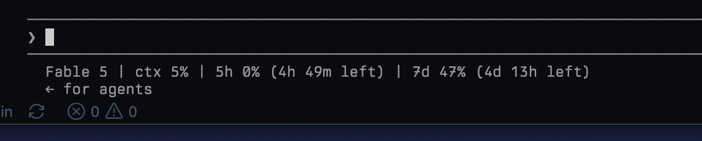
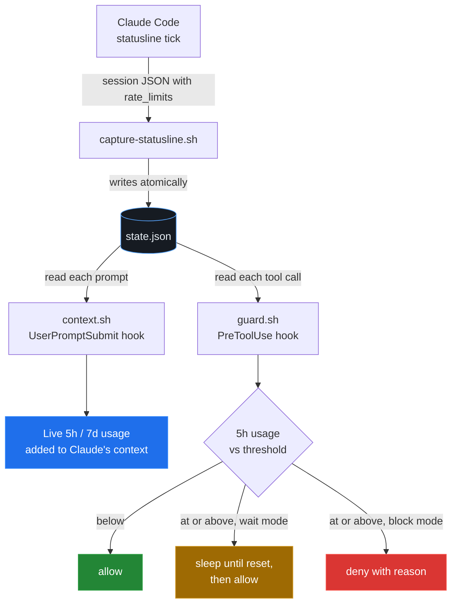

<h1 align="center">usage-guard</h1>

<p align="center">
  
  
  
  
</p>

<p align="center">
  <b>A Claude Code plugin that makes the agent aware of your subscription usage limits and pauses work before you hit them.</b>
</p>

<p align="center">
  
</p>

---

## What it does

- **Awareness.** Every prompt turn, Claude sees your live 5-hour and 7-day usage percentages and reset times, so it can plan and checkpoint work as the window fills.
- **Guard.** Before every tool call, a hook checks usage. At or above the threshold (default **98%** of the 5-hour window) it either sleeps until the window resets and then continues (`wait` mode, the default), or denies the tool call with an explanation so Claude stops gracefully (`block` mode).

## How it works

Claude Code hooks do **not** receive `rate_limits` on stdin, but the **statusline** does (Claude Code v2.1+, on Pro or Max subscription auth only; API-key logins get no rate-limit data). So usage-guard is built in two halves: the statusline captures a snapshot to a small state file, and the hooks read it.



Because the statusline is the only thing that writes `state.json`, both halves are required: keep the statusline wired even after the plugin is installed.

## Requirements

- Claude Code v2.1+, signed in with a Pro or Max subscription (rate-limit data is not available for API-key auth)
- `jq`
- macOS, Linux, or WSL (bash)

## Install

Three commands, no cloning.

### 1. Add the marketplace and install the plugin

```bash
claude plugin marketplace add gokhanarkan/claude-usage-guard
claude plugin install usage-guard@claude-usage-guard
```

### 2. Wire the statusline

The hooks read their data from the statusline, and a plugin cannot register the main statusline itself, so this step does it for you. Inside Claude Code, run:

```
/usage-guard:setup
```

It copies the capture script to a stable location (`~/.claude/usage-guard/`) and points your `statusLine` at it, so it keeps working across plugin updates. If you already have a statusline, it leaves yours untouched and prints how to run both together. Re-run it after a plugin update to refresh the copy.

<details>
<summary>Prefer to edit settings.json yourself?</summary>

`/usage-guard:setup` places the capture script at `~/.claude/usage-guard/capture-statusline.sh`. Run it once so that file exists, then, if you would rather own the settings entry, set:

```json
{
  "statusLine": {
    "type": "command",
    "command": "bash ~/.claude/usage-guard/capture-statusline.sh"
  }
}
```

To keep an existing statusline, set `USAGE_GUARD_INNER_STATUSLINE` to your current command; the wrapper captures first, then renders yours.

</details>

### 3. Restart and verify

Restart Claude Code, or run `/reload-plugins`. `claude plugin list` should show `usage-guard` as enabled, and after the first response your statusline shows the live percentages.

## Configuration

All configuration is via environment variables, so you can set them per shell or in your Claude Code environment.

| Variable | Default | Meaning |
| --- | --- | --- |
| `USAGE_GUARD_THRESHOLD` | `98` | Percentage of the 5-hour window at which the guard engages |
| `USAGE_GUARD_MODE` | `wait` | `wait` sleeps until reset then continues; `block` denies tool calls with an explanation |
| `USAGE_GUARD_MAX_WAIT` | `19800` | Maximum seconds a single pause may last (safety cap) |
| `USAGE_GUARD_STALE_AFTER` | `900` | Ignore captured state older than this many seconds |
| `USAGE_GUARD_RESET_BUFFER` | `60` | Extra seconds to wait past the official reset time |
| `USAGE_GUARD_INNER_STATUSLINE` | unset | Your existing statusline command, rendered after capture |
| `USAGE_GUARD_STATE` | `~/.claude/usage-guard/state.json` | State file location |

## Choosing a mode

- **`wait` (default)** freezes the whole session during the sleep. That is the point, but it means the terminal sits on one pending tool call for potentially hours. The hook timeout in `hooks.json` is set to 21600s (6 hours) to allow this. If you lower `USAGE_GUARD_MAX_WAIT`, lower the timeout to match; the timeout must exceed the maximum wait.
- **`block` is gentler.** Claude receives the denial reason, understands why, and can summarise progress for you instead of hammering retries. Try both; `block` plus the context injection is often enough to make the agent pace itself.

## Test it without spending your quota

Fake a near-limit state and watch the guard engage:

```bash
mkdir -p ~/.claude/usage-guard
cat > ~/.claude/usage-guard/state.json <<EOF
{"rate_limits":{"five_hour":{"used_percentage":99,"resets_at":$(( $(date +%s) + 120 ))},
"seven_day":{"used_percentage":40,"resets_at":$(( $(date +%s) + 86400 ))}},"captured_at":$(date +%s)}
EOF
echo '{}' | USAGE_GUARD_MODE=block bash scripts/guard.sh
```

That should print a deny JSON. Delete the fake state file afterwards so real captures take over again.

## Good to know

- **Percentages are usage-based, not time-based.** The 5-hour window resets all at once at `resets_at`; usage does not tick down gradually.
- **Staleness is handled.** The statusline only updates after API responses. While the guard sleeps, no updates arrive, so the guard deletes the state file after a pause to force a fresh capture.
- **The 7-day window is not guarded by default** (pausing for days is rarely what you want), but the data is in the state file if you want to extend `guard.sh`.
- **Everything fails open.** No `jq`, no capture yet, or stale data all mean the guard allows the tool call rather than blocking your work.

## Licence

MIT. See [LICENSE](LICENSE).
